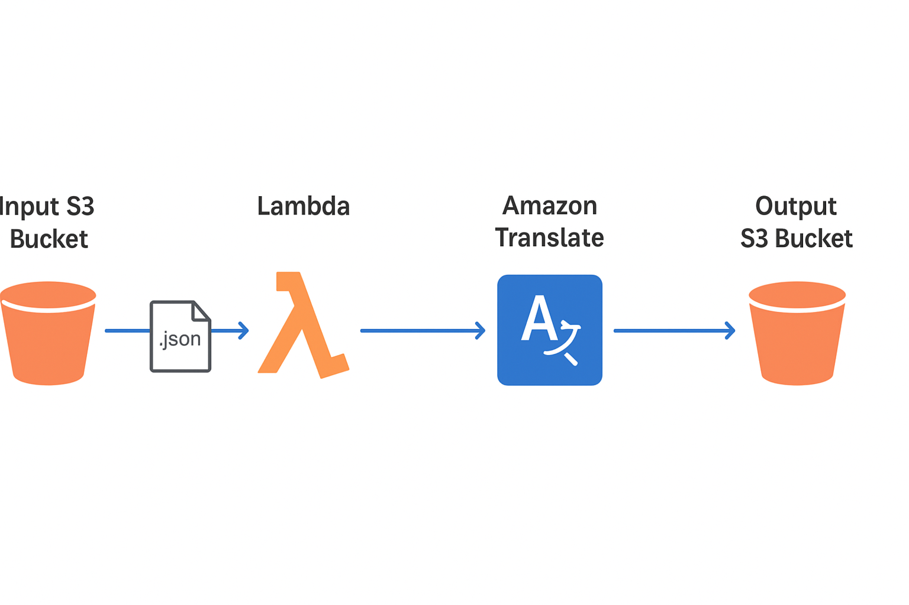

# 🌍 CloudLingo: A Serverless Language Translator with AWS Translate and Lambda
This project demonstrates a **serverless translation pipeline** using **Amazon S3, AWS Lambda, and Amazon Translate**. Uploading a JSON file to the input bucket triggers translation into target languages (e.g., Arabic, Spanish, Japanese), with results saved to the output bucket as -output.json."

> under continuous development, return soon for complete docs
  
---

## 📌 Features  
- 🚀 **Event-driven workflow** – S3 triggers Lambda on file upload.  
- 🌐 **Multi-language support** – Uses Amazon Translate to translate text into Arabic, Spanish, Japanese (and more if configured).  
- 📂 **Automated output naming** – Input `file.json` → Output `file-output.json`.  
- ☁️ **Fully serverless** – No servers to manage, pay-per-use model.  

---

## 🏗️ Architecture  

  

**Flow:**  
1. A JSON file is uploaded to the **Input S3 Bucket**.  
2. **S3 Event Notification** triggers the **Lambda function**.  
3. The Lambda function:  
   - Reads the file.  
   - Sends text to **Amazon Translate**.  
   - Stores translated results in the **Output S3 Bucket**.  
4. The output file is saved as `filename-output.json`.  

---

## Step-by-Step Guidelines
---
text

