# 🌍 CloudLingo: A Serverless Language Translator with AWS Translate and Lambda

_Author: Bernard Kwame Solodzi  
Date: 2025-09-01_

> under continuous development, return soon for complete docs
  
---

## 📌 Features  
- 🚀 **Event-driven workflow** – S3 triggers Lambda on file upload.  
- 🌐 **Multi-language support** – Uses Amazon Translate to translate text into Arabic, Spanish, Japanese (and more if configured).  
- 📂 **Automated output naming** – Input `file.json` → Output `file-output.json`.  
- ☁️ **Fully serverless** – No servers to manage, pay-per-use model.

---

## Introduction

CloudLingo is an automated translation pipeline using AWS services. JSON files containing text are uploaded into an **S3 Request Bucket**, which triggers a **Lambda function**. The Lambda reads the file, uses **Amazon Translate** to convert the text into the target language, and stores the translated output in an **S3 Response Bucket**.  

This project demonstrates **event-driven architecture** on AWS to solve real-world problems, eliminating manual translation and enabling automated, scalable, and cost-effective multilingual support.

---

## 🏗️ Architecture  

  

**Flow:**  
1. A JSON file is uploaded to the **Input S3 Bucket**.  
2. **S3 Event Notification** triggers the **Lambda function**.  
3. The Lambda function:  
   - Reads the file.  
   - Sends text to **Amazon Translate**.  
   - Stores translated results in the **Output S3 Bucket**.  
4. The output file is saved as `filename-output.json`.  

---

## Table of Contents

1. [Introduction](#introduction)  
2. [Architecture](#architecture)
3. [Prerequisites](#prerequisites)
4. [Objectives](#objectives)  
5. [Step 1: Deploy Resources with CloudFormation](#step-1-deploy-resources-with-cloudformation)  
6. [Step 2: Review IAM Role and Policies](#step-2-review-iam-role-and-policies)  
7. [Step 3: Lambda Function Configuration](#step-3-lambda-function-configuration)  
8. [Step 4: Test the Translation Pipeline](#step-4-test-the-translation-pipeline)
9. [Monitoring](#monitoring)  
10. [Challenges and Lessons Learned](#challenges-and-lessons-learned)  
11. [Conclusion](#conclusion)
12. [References](#references)  

---

## Prerequisites

Ensure the following are installed:
- [AWS CLI](https://docs.aws.amazon.com/cli/latest/userguide/install-cliv2.html)
- [Python 3.9+](https://www.python.org/downloads/)
- AWS credentials configured via `aws configure`

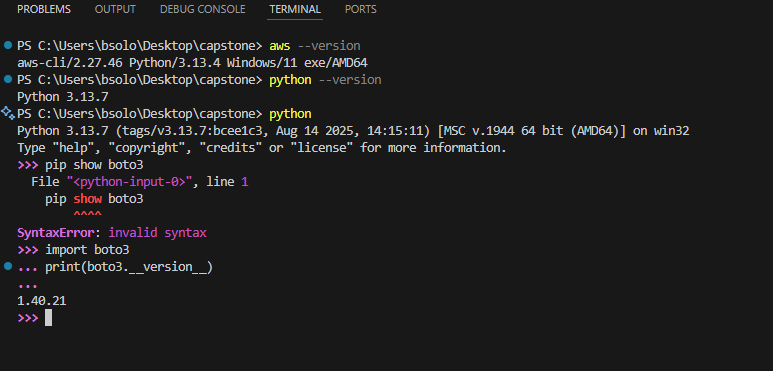

---

## Objectives

1. Automate S3-triggered Lambda-based translation using AWS Translate.
2. Use CloudFormation to create:
   - S3 buckets with lifecycle policies
   - Lambda execution role with scoped IAM permissions
   - Lambda deployment from zip file
   - S3 event notification trigger for Lambda
3. Package and deploy Python-based Lambda zip
4. Log outputs to CloudWatch
5. Save translated files into a different S3 bucket

---

## Step-by-Step Guidelines

---

## Step 1: Deploy Resources with CloudFormation

1. Use the provided CloudFormation template (`translation-setup-with-lambda.yaml`) to provision all required AWS resources:
   - S3 Request Bucket (input)
   - S3 Response Bucket (output)
   - Lambda function
   - IAM roles and policies
   - S3 event notification trigger

2. In the AWS Console, go to **CloudFormation** → **Create stack** → **Upload a template file**.

3. Follow the prompts to deploy the stack.  
   - You can review and customize parameters (bucket names, Lambda environment variables, etc.) as needed.

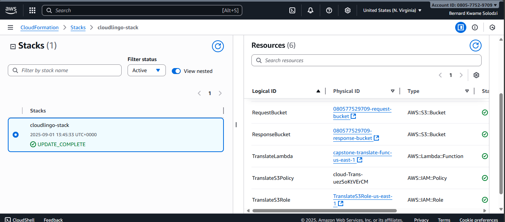

---

## Step 2a: Review IAM Role and Policies

* The CloudFormation template creates an **IAM Role** for Lambda with:
  * **AWSLambdaBasicExecutionRole**
  * Custom inline policy for:
    * `s3:GetObject`, `s3:PutObject`, `s3:ListBucket`
    * `translate:TranslateText`

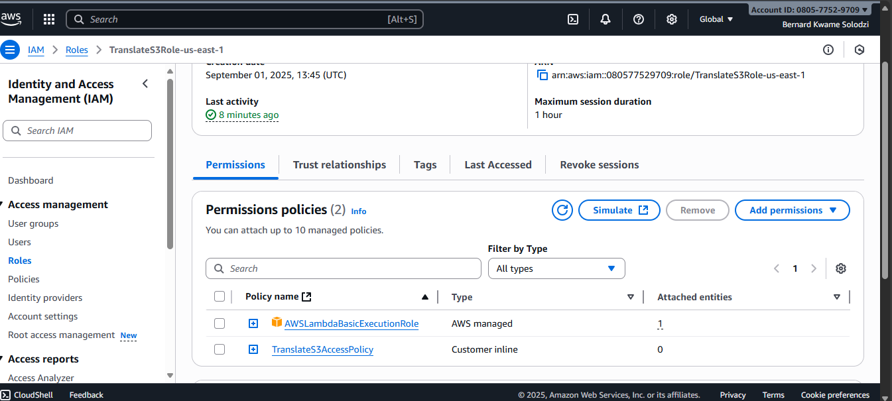  

* After deployment, review the IAM role in the AWS Console and adjust permissions if you need additional access.

## Step 2b: Review the Request S3 bucket to be sure the an s3 event notification event was properly configured as shouw below

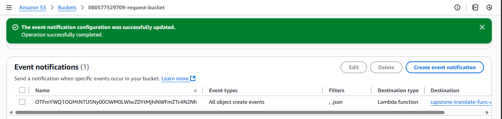 

---

## Step 3: Lambda Function Configuration

* The Lambda function is provisioned by CloudFormation.
* Runtime: **Python 3.12**
* Code: `lambda.py` (translation logic).
* Environment variable:
  * `OUTPUT_BUCKET = <response-bucket-name>`

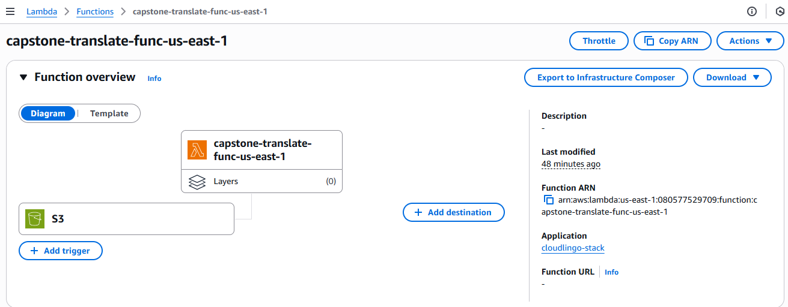

* You can update the Lambda code or environment variables directly in the AWS Console or by updating the CloudFormation stack.

---

## Step 4: Test the Translation Pipeline

1. Upload a JSON file in the format below into the Request Bucket:

```json
{
  "source_language": "en",
  "target_language": "fr",
  "text": "Hello, this is my 2nd capstone project, this is from lambda!"
}

```

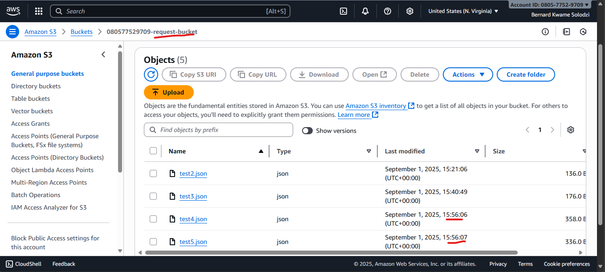

2. Check the Response Bucket for an output file (e.g., `test-output.json`):

```json
{
    "source_language": "en", 
    "target_language": "fr", 
    "original_text": "Hello, this is my 2nd capstone project, this is from lambda!", 
    "translated_text": "Bonjour, c'est mon deuxième projet de synthèse, il vient de Lambda!"
}
```

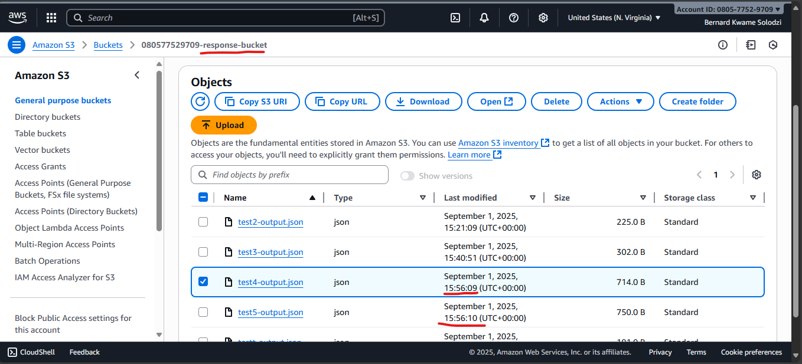

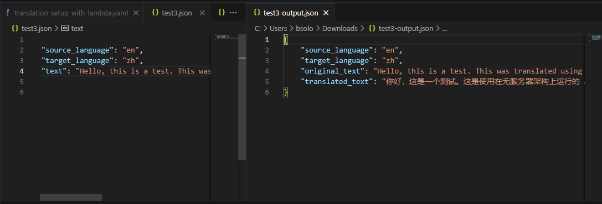

Another Test

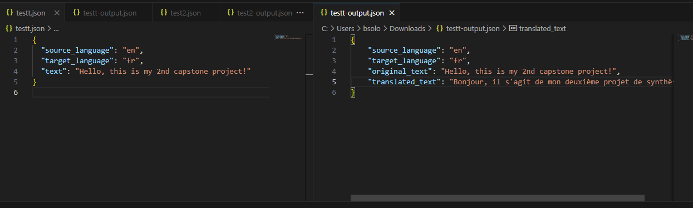

---
## Monitoring 

Lambda Function

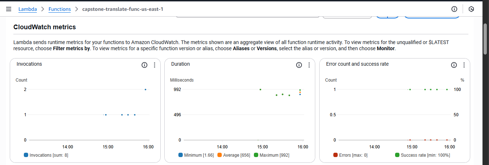
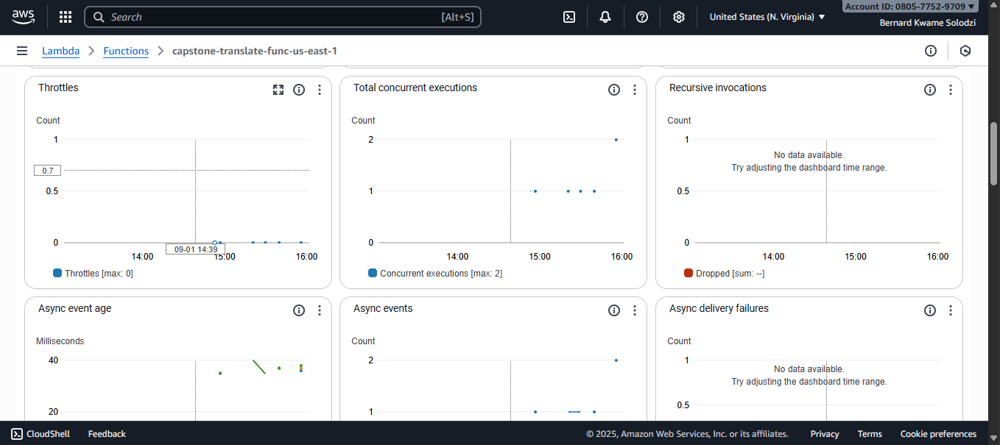


AWS Translate Dashboard
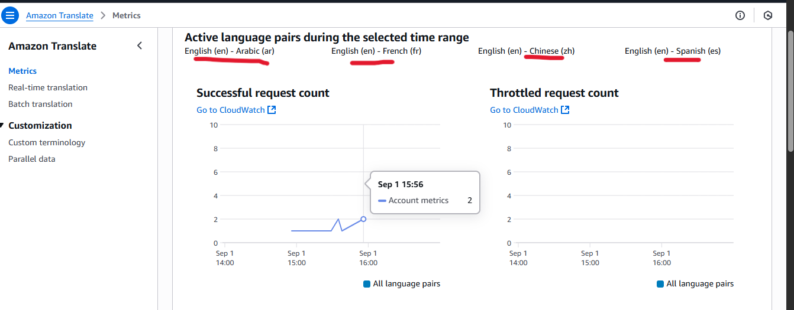
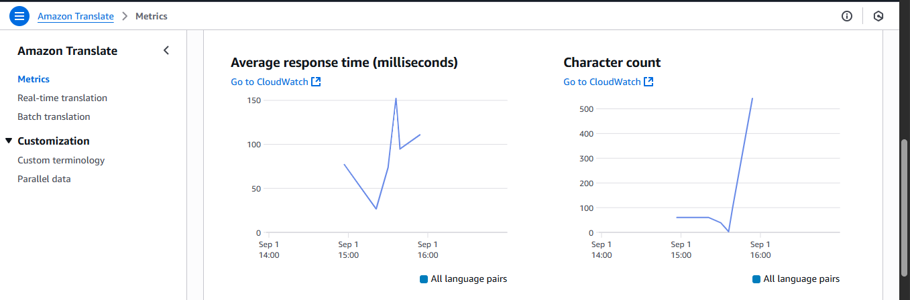

---
## Challenges and Lessons Learned

* **Challenge:** Ensuring Lambda had the correct IAM permissions to access both S3 buckets and Translate.
* **Troubleshooting:** Debugging with CloudWatch logs helped identify permission errors and fix JSON parsing issues.
* **Lesson Learned:** Properly structuring the input/output JSON files is crucial for batch processing and future scalability.

---

## Conclusion

This project demonstrates how AWS serverless services can work together to create an **automated translation system**. With S3 for storage, Lambda for processing, and Translate for language conversion, CloudLingo provides a **scalable, cost-effective, and event-driven pipeline**. It eliminates manual translation steps and makes it easy to support multilingual workflows in real time.

---

## References

* [Amazon S3 Documentation](https://docs.aws.amazon.com/AmazonS3/latest/userguide/Welcome.html)
* [AWS Lambda Documentation](https://docs.aws.amazon.com/lambda/latest/dg/welcome.html)
* [Amazon Translate Documentation](https://docs.aws.amazon.com/translate/latest/dg/what-is.html)
* [AWS IAM Documentation](https://docs.aws.amazon.com/IAM/latest/UserGuide/introduction.html)

---
